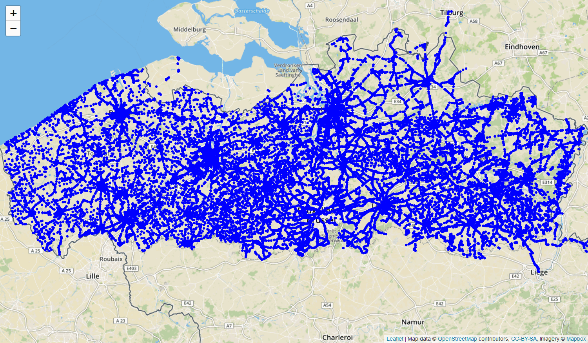

# Linked Connections Clustering Visualization



## Usage

Build webpack bundle of Planner.js and copy it to `./visual` directory.

```bash
$ tsc
$ npm run webpack
$ cp ./dist/bundle.js ./visual/bundle.js
```

Note: make sure Planner.js is configured properly i.e. a [Linked Connections Clustering Server](https://github.com/Buccaneer/lc-cluster) is available and Planner.js is configured to use it.

Open `./visual/visualization.html` in your favourite browser.
